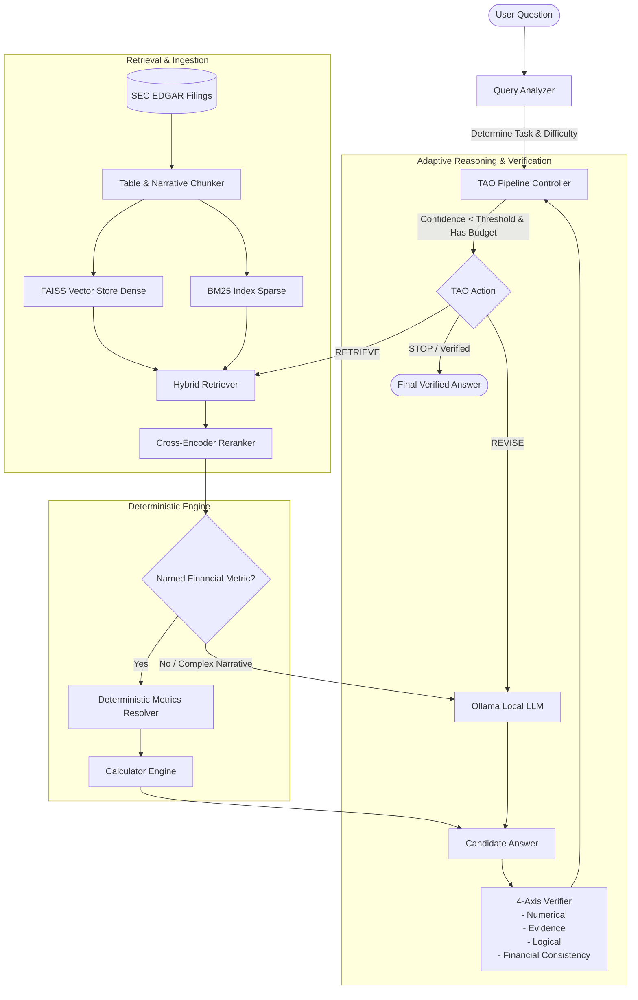

# 📈 TAO-Fin: Verifier-Guided Financial Reasoning & Hybrid RAG System

[](https://fastapi.tiangolo.com/)
[](https://www.python.org/)
[](https://github.com/facebookresearch/faiss)
[](https://github.com/dorianbrown/rank_bm25)
[](LICENSE)

**TAO-Fin** is an advanced, production-grade financial question-answering and reasoning framework designed to analyze SEC EDGAR filings (10-K, 10-Q, 8-K) and market data with extreme factual accuracy. 

By pairing a **Think-Act-Observe (TAO) adaptive reasoning loop** with **hybrid vector + lexical retrieval**, **cross-encoder reranking**, **deterministic financial table parsing/arithmetic**, and a **multi-axis heuristic verifier**, TAO-Fin prevents hallucinated numbers, ensures strict citation grounding, and dramatically reduces inference compute costs.

---

## 🎯 Key Challenges Solved

| Problem in Naive Financial RAG | TAO-Fin Solution |
| :--- | :--- |
| **Arithmetic Hallucinations**: LLMs frequently fail at calculating margins, growth rates, and YoY ratios. | **Deterministic Metrics Resolver & Calculator**: Parses SEC financial statement tables directly and computes exact ratios without passing arithmetic to the LLM. |
| **Document Complexity & Lost Tables**: Narrative chunking destroys tabular structure in 10-Ks. | **Specialized Table & Narrative Chunker**: Dual-pipeline extraction preserving HTML table semantics alongside narrative text. |
| **Fixed Compute Waste**: Running expensive multi-step reasoning chains for trivial lookups. | **Query Analyzer & Dynamic Controller**: Categorizes difficulty (`simple`, `moderate`, `complex`) and dynamically manages reasoning iterations and retrieval expansions. |
| **Ungrounded / Speculative Answers**: LLMs guessing figures when evidence is incomplete. | **4-Axis Verifier**: Evaluates answers across Numerical, Evidence, Logical, and Financial Consistency criteria. |

---

## 🏗️ System Architecture



---

## ⚡ Core Features

### 1. 🔄 Think-Act-Observe (TAO) Adaptive Control Loop
- **Dynamic Computational Budgeting**: Queries are classified into `simple` (e.g., direct revenue lookup), `moderate` (single calculation or 2-item comparison), and `complex` (trend explanations, multi-year analyses), assigning custom retrieval top-$k$ and iteration caps.
- **Adaptive Execution**: 
  - `STOP`: Confidence threshold met ($\ge 0.90$) or compute budget exhausted.
  - `REVISE`: Evidence is sound but answer failed numerical/logical/financial checks.
  - `RETRIEVE`: Evidence is insufficient; expands retrieval window ($top\_k$).
- **Compute Efficiency Tracking**: Quantifies and reports compute savings against fixed-budget baselines.

### 2. 🔍 Hybrid Search & Cross-Encoder Reranking
- **Dense Embeddings**: Semantic retrieval using `sentence-transformers` (`all-MiniLM-L6-v2`) indexed in **FAISS**.
- **Sparse BM25 Index**: Exact keyword matching for financial terms, dates, and ticker symbols with `rank-bm25`.
- **Cross-Encoder Reranking**: Re-scores top candidates to maximize relevance before context injection.

### 3. 📊 Table Extraction & Deterministic Metrics Resolver
- Extracts financial tables from SEC 10-K/10-Q HTML filings (`table_parser.py`).
- Deterministically parses key statements (Income Statement, Balance Sheet, Cash Flows).
- Accurately distinguishes **annual 10-K filings** from **quarterly 10-Q filings** to avoid fiscal-year confusion.
- Built-in formulas for Operating Margin, Gross Margin, Net Margin, YoY Growth, and more.

### 4. 🛡️ 4-Axis Verification System
1. **Numerical Verification**: Verifies that every number mentioned in the answer directly traces to retrieved evidence or verified calculation outputs.
2. **Evidence Grounding**: Confirms citations and lexical alignment with retrieved sources.
3. **Logical Consistency**: Flags self-contradictions and unwarranted hedges.
4. **Financial Consistency**: Ensures calculation-focused queries provide concrete mathematical outputs rather than vague narrative summaries.

### 5. 🌐 Market Intelligence & SEC Ingestion
- Real-time stock quotes, market caps, and historical OHLCV pricing via `yfinance` for **US**, **NSE**, and **BSE** markets.
- Automated SEC EDGAR sync pipeline resolving company CIKs, downloading filings, parsing content, and updating local SQLite databases.

### 6. 🧪 Benchmark Evaluation (FinanceBench)
- Automated evaluation harness against the **FinanceBench** benchmark suite (`evaluation/run_financebench.py`).
- Assesses retrieval recall, numerical correctness, verifier pass rates, and compute reduction.

---

## 📁 Repository Structure

```text
tao-fin-capstone/
├── backend/
│   ├── app/
│   │   ├── db/
│   │   │   ├── database.py         # SQLAlchemy engine and session setup
│   │   │   └── models.py           # Database models (Company, SECFiling, MarketQuote, PriceHistoryBar)
│   │   ├── routes/
│   │   │   ├── analyze.py          # POST /api/analyze - TAO pipeline endpoint
│   │   │   ├── companies.py        # Company listing, inspection, and filing sync
│   │   │   ├── market.py           # Real-time quotes and historical pricing
│   │   │   └── sec.py              # Direct SEC EDGAR API queries
│   │   ├── services/
│   │   │   ├── bm25_index.py       # Sparse BM25 retrieval index
│   │   │   ├── calculator.py       # Safe mathematical evaluation and numerical matching
│   │   │   ├── chunker.py          # Sliding-window document chunker
│   │   │   ├── company_service.py  # Automated filing download and data syncing
│   │   │   ├── embeddings.py       # SentenceTransformers embedding generation
│   │   │   ├── financebench.py     # FinanceBench dataset loader
│   │   │   ├── financial_lookup.py # Lookup utilities for financial metrics
│   │   │   ├── hybrid_retriever.py # FAISS + BM25 hybrid search retriever
│   │   │   ├── market_data.py      # Yahoo Finance integration
│   │   │   ├── metrics_resolver.py # Deterministic financial ratio resolver
│   │   │   ├── ollama_client.py    # Local LLM integration via Ollama
│   │   │   ├── query_analyzer.py   # Rule-based query difficulty & task classifier
│   │   │   ├── rag_pipeline.py     # Core RAG retrieval and prompting logic
│   │   │   ├── reranker.py         # Cross-encoder reranking service
│   │   │   ├── sec_client.py       # SEC EDGAR API client
│   │   │   ├── sec_parser.py       # HTML and filing text parsing
│   │   │   ├── table_parser.py     # HTML financial table extractor
│   │   │   ├── tao_controller.py   # Adaptive state manager and decision policy
│   │   │   ├── tao_pipeline.py     # End-to-end TAO orchestrator
│   │   │   ├── vector_store.py     # FAISS vector store wrapper
│   │   │   └── verifier.py         # 4-axis response verifier
│   │   ├── main.py                 # FastAPI application and startup index builder
│   │   └── requirements.txt        # Backend dependencies
│   └── tests/                      # Unit and integration test suite
├── Data/
│   ├── financebench/               # FinanceBench dataset & annotations
│   ├── pdfs/                       # Source financial PDF filings
│   └── sec/                        # Downloaded raw SEC filings & parsed tables
└── evaluation/
    ├── financebench_evaluator.py   # Benchmark evaluation logic & metrics
    └── run_financebench.py         # CLI runner for FinanceBench evaluation
```

---

## 🚀 Getting Started

### Prerequisites
- **Python 3.10+**
- **Ollama** installed and running locally with your chosen model:
  ```bash
  ollama pull llama3:8b
  ollama serve
  ```

### 1. Installation

Clone the repository and install backend dependencies:

```bash
git clone https://github.com/sanskrutishah14/tao-fin-capstone.git
cd tao-fin-capstone/backend

# Create and activate virtual environment
python -m venv venv
# On Windows:
.\venv\Scripts\activate
# On Linux/macOS:
source venv/bin/activate

# Install requirements
pip install -r requirements.txt
```

### 2. Syncing Company Filings

Before running queries, sync at least one company ticker (e.g. `AAPL`, `MSFT`, `GOOGL`) to download SEC filings and populate the database:

```bash
# Start the server
uvicorn app.main:app --reload --port 8000
```

Trigger a sync via the API:
```bash
curl -X POST http://localhost:8000/api/companies/AAPL/sync
```
*Note: After syncing new companies, restart the server so the startup hook indexes the newly downloaded filings into FAISS and BM25.*

---

## 📡 API Reference

### 🧠 Analysis & Reasoning
- **`POST /api/analyze`**
  - Executes the full TAO verifier-guided reasoning pipeline.
  - **Request Body**:
    ```json
    {
      "question": "What was Apple's gross margin in fiscal year 2024?"
    }
    ```
  - **Response**: Returns final answer, citations, confidence score, verification checks, and compute savings metrics.

### 🏢 Companies & SEC Filings
- **`GET /api/companies`**: Lists all tracked and synced companies.
- **`GET /api/companies/{ticker}`**: Retrieves company metadata, synced filings, and recent quote snapshots.
- **`POST /api/companies/{ticker}/sync`**: Downloads recent 10-K/10-Q SEC filings and refreshes market data.
- **`GET /api/sec/company/{cik}`**: Direct SEC company profile lookup.
- **`GET /api/sec/company/{cik}/filings`**: Lists annual reports directly from SEC EDGAR.

### 📊 Market Data
- **`GET /api/market/quote/{symbol}?exchange=US`**: Fetches real-time quote (supports `US`, `NSE`, `BSE`).
- **`GET /api/market/history/{symbol}?exchange=US&period=1mo`**: Fetches historical OHLCV data.

---

## 🧪 Evaluation & Testing

### Running Tests
Execute unit tests for parsing, chunking, embeddings, and retrieval:
```bash
pytest backend/tests
```

### Running FinanceBench Evaluation
Evaluate the system against financial reasoning benchmarks:
```bash
python -m evaluation.run_financebench --limit 50
```

---

## 🛠️ Tech Stack & Libraries

- **Framework**: [FastAPI](https://fastapi.tiangolo.com/), [Pydantic](https://docs.pydantic.dev/)
- **Embeddings & Search**: [Sentence-Transformers](https://www.sbert.net/), [FAISS](https://github.com/facebookresearch/faiss), [Rank-BM25](https://github.com/dorianbrown/rank_bm25)
- **Database & Ingestion**: [SQLAlchemy](https://www.sqlalchemy.org/), [BeautifulSoup4](https://www.crummy.com/software/BeautifulSoup/), [lxml](https://lxml.de/), [yfinance](https://github.com/ranaroussi/yfinance)
- **Local LLM**: [Ollama](https://ollama.com/)

---

## 👥 Authors & Collaborators

- **Sanskruti Shah** — Lead Contributor ([@sanskrutishah14](https://github.com/sanskrutishah14))
- **Dhruva** — Collaborator & Co-Developer

---

## 📄 License

This project is licensed under the MIT License — see the [LICENSE](LICENSE) file for details.
